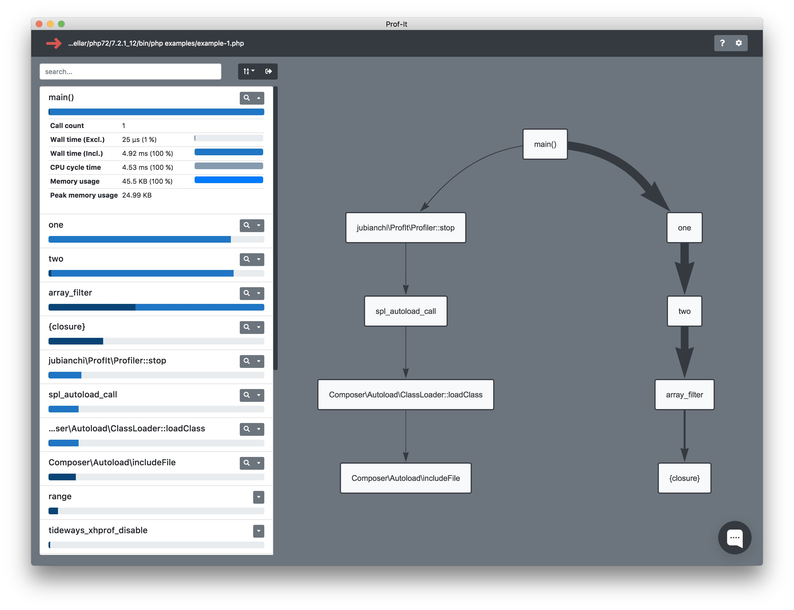

# prof-it

Profile & Profit

## Table of contents

* [Installation](installation.md)
    * [How to install XHProf](installation.md#how-to-install-xhprof)
        * [Prepare your environment](installation.md#prepare-your-environment)
            * [On MacOS](installation.md#on-macos)
            * [On Debian](installation.md#on-debian)
            * [On RHEL](installation.md#on-rhel)
        * [Compile the extension](installation.md#compile-the-extension)
    * [How to install the PHP library](installation.md#how-to-install-the-php-library)
    * [How to install the client application](installation.md#how-to-install-the-client-application)
        * [On MacOS](installation.md#on-macos-1)
        * [On Debian](installation.md#on-debian-1)
        * [On RHEL](installation.md#on-rhel-1)
* [Profiling](profiling.md)
    * [Run your first profile](profiling.md#run-your-first-profile)
    * [Open your first profile](profiling.md#open-your-first-profile)