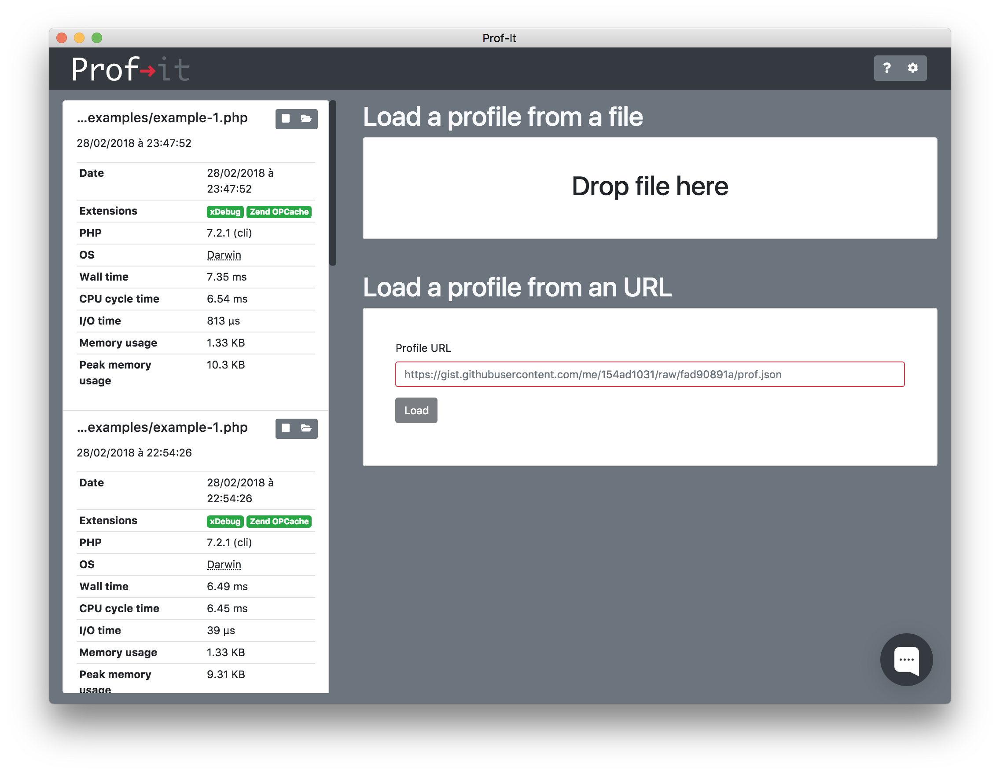

# Profiling

In the following section, we will profile this code:

```php
<?php

function one(int $size = null): array
{
    return two($size ?: 100);
}

function two(int $size): array
{
    return array_filter(range(0, $size), function ($i) { return $i % 2; });
}
```

## Run your first profile

To run your first profile you will need an instance of `jubianchi\ProfIt\Profiler`. With this class you will be able to
start and stop the profiling session: 

```php
<?php

$profiler = new \jubianchi\ProfIt\Profiler();
$profiler->start();

one(1000);

$profile = $profiler->stop();
```

As you can see in the above example, the `start` method will ask the profiler to start collect data. The `stop` method 
will then ask the profiler to stop profiling and will return the actual profile data as a `jubianchi/ProfIt/Profile`
instance. 

You will now have to export the profile data to be able to open it in the client application:

```php
<?php

$profile = $profiler->stop();
$profile->export(__DIR__);
```

The `export` method will write the profile data to a file in the provided directory.

## Open your first profile

Now open the client application and drop the file on the drop zone:



You will be redirected to the profile view:


On the left you will find the function list the profiler collected data about and on the right the call graph. Each
part of this view lets you get insight on what happened while running your code:

* the function list will let you see every function called along with some metrics about them,
* the call graph will let you see in which order the were called and where resources were spent.